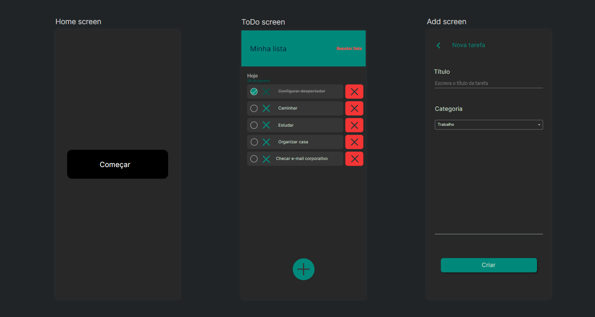
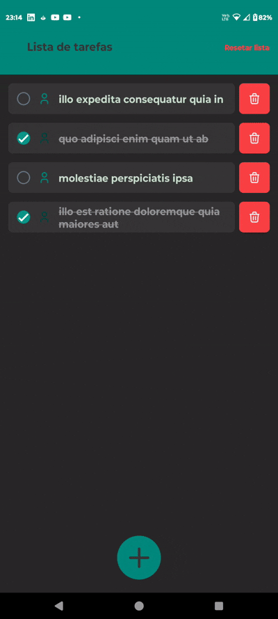

# ToDo List Mobile App 📱

Aplicativo de gerenciamento de tarefas desenvolvido em React Native com TypeScript e Expo. Projeto criado como parte do processo avaliativo para vaga de Desenvolvedor Front-end Júnior.

<div>
    
    
</div>

## Funcionalidades ✨

- Adição de novas tarefas
- Marcar/desmarcar tarefas como concluídas
- Exclusão de tarefas individuais
- Persistência local de dados (AsyncStorage)
- Interface intuitiva e responsiva
- Tipagem estática com TypeScript
- Validação de entradas
- Feedback visual interativo

## Tecnologias Utilizadas 🛠️

- **React Native** (Framework mobile)
- **Expo** (Desenvolvimento e build)
- **TypeScript** (Tipagem estática)
- **AsyncStorage** (Persistência de dados localmente)
- **Expo router** (Navegação entre telas)
- **Tabler Icons** (Ícones)
- **React Native Reanimated** (Animações)
- **ESLint/Prettier** (Padronização de código)
- **Trello** (Gerenciamento do projeto)
- **QuantUX** (Prototipação do app)

## Pré-requisitos 📋

- Node.js (v18+)
- npm (v9+) ou yarn (v1.22+)
- Expo CLI (v50+)
- Dispositivo móvel com Expo Go ou emulador instalado

## Instalação e Execução 🚀

1. Clone o repositório:
```bash
git clone https://github.com/seu-usuario/todo-list-react-native.git
```
2. Instalação de dependências
```bash
cd todo-list-react-native
npm install
# ou
yarn install
```
3. Inicie o servidor para desenvolvimento
```bash
npx expo start
```
4. Inicie o aplicativo em um dispositivo Android, IOS ou em um navegador
- Escaneie o QR code com o app Expo Go (Android) ou Camera (iOS) ou: 
    - Pressione **A** para Android emulador

    - Pressione **I** para iOS simulator

    - Pressione **W** para web browser
- Também é possível utilizar um emulador
    - Android: [Link da documentação](https://docs.expo.dev/workflow/android-studio-emulator/)
     - IOS: [Link da documentação](https://docs.expo.dev/workflow/ios-simulator/)


## Estrutura do Projeto 📂

```bash
src/
├── app/             # Telas do projeto
├── components/      # Componentes reutilizáveis
├── utils/           # Utilitários e helpers
|   ├── types.ts     # Tipos TypeScript
|   ├── icons.ts     # Ícones usados no projeto
|   ├── toast.ts     # Toast usado no projeto
├── store/           # Estrutura de persistência dos dados
├── theme/           # Tema do projeto (paleta)
└── index.tsx        # Entrada principal
```

## Decisões Técnicas ⚙️

- Arquitetura modular e componentizada

- Tipagem rigorosa para melhor manutenibilidade

- Animações simples fluidas com Reanimated

- Persistência de dados offline

- Gestão de estado via [React API](https://react.dev/learn/managing-state)

- Padrão de estilos centralizado

## Próximos Passos (Roadmap) 🔮

    1. Inserir componente de data atual na tela de exibição das tarefas

    2. Melhorar layout da página Home

    3. Adicionar autenticação de usuário

    4. Adicionar tematização (claro e escuro)

    5. Implementar testes unitários e E2E

## Aprendizados 📚

Durante o desenvolvimento, pude aprimorar minhas habilidades em:

- Gerenciamento de estado em React Native

- Tipagem avançada com TypeScript

- Configuração de projetos Expo

- Persistência de dados local

- Criação de componentes reutilizáveis

- Implementação de animações simples fluidas

- Debugging em ambiente móvel

- Organização de projetos escaláveis

**Feito com ❤️ por Vinícius - [Portfólio](https://devnicius.com.br/) | [Linkedin](https://www.linkedin.com/in/devnicius/)**
